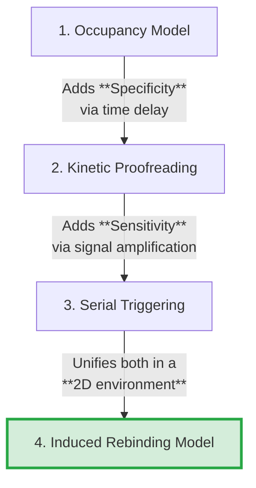
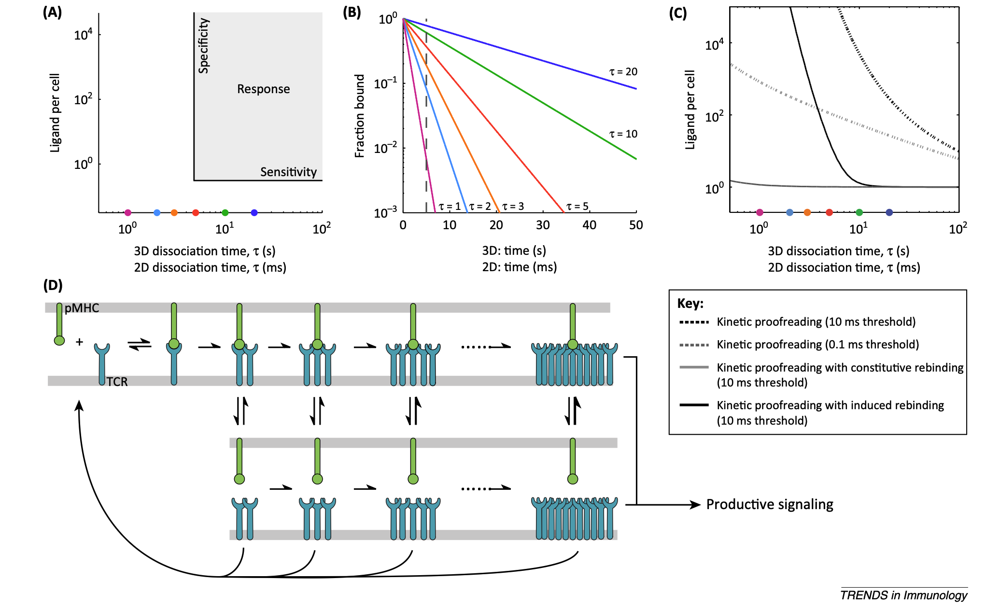
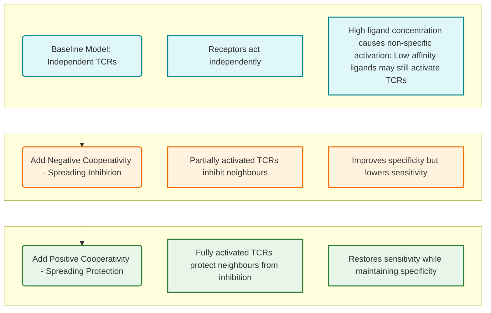
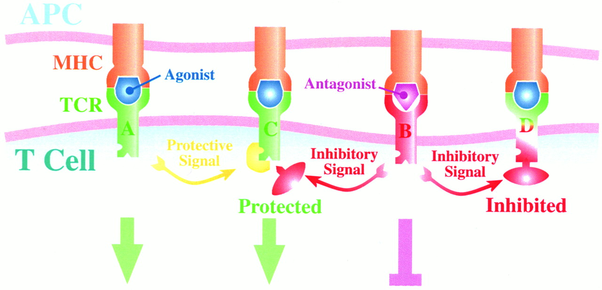
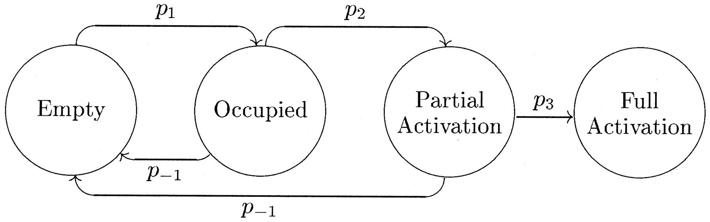
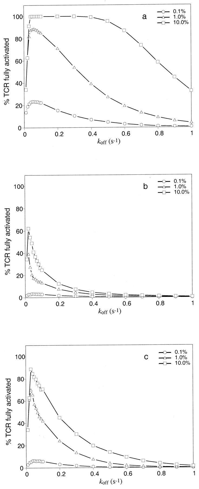

# NK cell receptor cooperativity and cytotoxic-decision making project

> The question to be answered:
> - How the difference between flux and the concentration of the activating receptor influence the quantification of NK cell activation.
> - How the coupling or cooperativity between receptor influences the signalling and decision-making in NK cells.
> - How the inhibitory signalling pathway assist the decision-making and NK cell education.

**The content**
- Mathematical modelling of TCR discrimination: how the cooperativity enhances TCR discrimination (both specificity & sensitivity)

- NK cell cytotoxic decision-making VS TCR discrimination: similarities and difference.

- Current theoretical & experimental work on NK cell decision-making

# 1. The mathematical model of TCR activation

Literature in this category can be found in the subfolder: 
[TCR](./TCR/)

> **Key Fact:** T-cell receptors (TCRs) recognise peptide–MHC (pMHC) complexes and discriminate foreign from self via peptide-dependent binding and signalling thresholds; agonist pMHC generally produce longer-lived interactions and stronger signals than self pMHC.

 

## 1-1. Cooperativity through re-binding

 

Trends in Immunology, 35(4), 153-158.

Dushek, O., & van der Merwe, P. A. (2014). An induced rebinding model of antigen discrimination. *Trends in Immunology, 35*(4), 153-158. **DOI:** [10.1016/j.it.2014.02.002](https://doi.org/10.1016/j.it.2014.02.002) 

[**PDF**](./TCR/An_induced_rebinding_model_of_antigen_discrimination.pdf)

 

Nature Reviews Immunology, 14(9), 619-629.

Lever, M., Maini, P. K., van der Merwe, P. A., & Dushek, O. (2014). Phenotypic models of T cell activation. *Nature Reviews Immunology, 14*(9), 619-629. **DOI:** [10.1038/nri3728](https://doi.org/10.1038/nri3728)

[**PDF**](./TCR/nri3728.pdf)

 
 

Here let's focus on the first one: [Trends in Immunology, 35(4), 153-158.](./TCR/An_induced_rebinding_model_of_antigen_discrimination.pdf)

### **Evolution of kinetic proofreading models**

1.  **Stage 1: Solving for Specificity**
    *   **Initial Model:** The **Occupancy Model**.
    *   **Defect:** This model failed to explain T-cell **specificity**, as it predicted that signaling was simply proportional to ligand affinity.
    *   **Solution:** **Kinetic Proofreading (KP)** was introduced. It proposed a time-delay mechanism (e.g., a series of phosphorylation steps) that filters out short-lived, low-affinity binders, thus ensuring only agonist ligands produce a signal.

2.  **Stage 2: Solving for Sensitivity**
    *   **Defect of KP:** While Kinetic Proofreading explained specificity, it predicted very low **sensitivity**, as the long binding times required would limit the total signal generated.
    *   **Solution:** The **Serial Triggering** model was proposed. It suggested that a single ligand could sequentially engage and trigger multiple TCRs, thereby amplifying the signal and accounting for the high sensitivity of T-cells.

3.  **Stage 3: Unifying in a Realistic Environment** (This is just for reference, might not be that important at the preliminary stage)
    *   **Defect of Previous Models:** Both KP and Serial Triggering were abstract concepts that did not fully account for the physical reality of the **2D cell surface**.
    *   **Solution:** The **Induced Rebinding Model** provides a unified framework. It integrates both KP and Serial Triggering within a 2D context, showing that when an agonist ligand unbinds, it is likely to quickly rebind to a nearby TCR. This "induced rebinding" dramatically amplifies the signal from agonists, providing a powerful mechanism that boosts both **specificity and sensitivity** simultaneously.
 
 

---
<figure>
  
  <figcaption><b>Figure 1</b>. Induced rebinding of T cell receptors improves antigen discrimination. <b>(A)</b> Schematic illustrating that T cells need to exhibit a response only to ligands with a dissociation time (τ = 1/koff) above a threshold (vertical line) even when only a single ligand is displayed (horizontal line) while not responding to ligands below the threshold even when displayed in large numbers. <b>(B)</b> The fraction of pMHCs that remain bound to the TCR over time for six pMHCs for the dissociation times indicated in units of s (for 3D) or ms (for 2D). Increasing the threshold binding time (vertical line) improves specificity because these lines diverge, but at the cost of sensitivity, because in all cases the fraction of pMHC that remains bound decreases exponentially. <b>(C)</b> Direct calculation of the response curves (analogous to panel A) for the standard kinetic proofreading model and kinetic proofreading with constitutive or induced rebinding for the threshold time indicated. <b>(D)</b> Schematic of kinetic proofreading with induced rebinding. Note that both 3D and reduced 2D dissociation times are shown (top panels). Coloured circles in panels A and C correspond to the six pMHCs indicated in panel B.</figcaption>
</figure>

---

### **Things we can learn from this literature**

- When we characterise our model, we can also focus one the balance of specificity and sensitivity to compare the models under different hypothesis. We can also generate the figures like [Figure 1 (A)](./TCR/figure1.png).

 
 

## 1-2. Cooperativity through inhibition and protection

C. Chan,A.J.T. George, & J. Stark,  Cooperative enhancement of specificity in a lattice of T cell receptors, Proc. Natl. Acad. Sci. U.S.A. 98 (10) 5758-5763, https://doi.org/10.1073/pnas.101113698 (2001). [**PDF**](./TCR/pq005758.pdf)
 

### Logics of this paper
> I think we can do similar structure/logic: We have a baseline model (No cooperativity) and we have two upgraded models (with cooperativity, introducing inhibitory receptors nodes). 
>
> Then we compare them. Hopefully we will obtain some conclusion

### The model
<figure>
  
  <figcaption> <b>Fig. 2. </b>Schematic illustration of the mechanism of action for spreading inhibition and protection.</figcaption>
  <!-- <figcaption>TCR A binds an agonist → activates → protects neighbours (e.g. TCR C) via ERK-1.
TCR B binds an antagonist → partial activation → inhibits neighbours (e.g. C, D) via SHP-1.
TCR C is protected → still activates when it sees agonist.
TCR D is inhibited → fails to activate despite agonist.</figcaption> -->
</figure>

<figure>
    
    <figcaption> <b>Fig. 3. </b>Possible changes of state for simulated TCR.
    </figcaption>
</figure>

 

- TCR A binds an agonist → activates → protects neighbours from inhibition
- TCR B binds an antagonist → partial activation → inhibits neighbours
- TCR C is protected → still activates when it sees agonist.
- TCR D is inhibited → fails to activate despite agonist.

> a fully activated TCR does not directly make neighbouring TCRs more active.
Instead, it performs a protective function, not a stimulatory one.

 

### Key results

    

        <figure>
            
            <figcaption><b>Fig. 4.</b> Effects of receptor crosstalk on specificity and sensitivity.</figcaption>
        </figure>
    

    

        <!-- Add your explanatory text here -->
            <ul>
                <li><b>Figure 4a – No cooperativity:</b>
                    <ul>
                        <li>TCRs respond to both high- and low-affinity ligands if ligand density is high.</li>
                        <li>Poor specificity: weak ligands can fully activate TCRs at high concentrations.</li>
                        <li>Broad activation curve → ligand discrimination is unreliable.</li>
                    </ul>
                </li>
                <li><b>Figure 4b – With spreading inhibition:</b>
                    <ul>
                        <li>Partially activated TCRs inhibit neighbours.</li>
                        <li>Activation is restricted to ligands near optimal koff.</li>
                        <li>Specificity improves sharply.</li>
                        <li>Tradeoff: overall sensitivity is reduced (fewer TCRs activate).</li>
                    </ul>
                </li>
                <li><b>Figure 4c – With inhibition + protection:</b>
                    <ul>
                        <li>Fully activated TCRs protect neighbours from inhibition.</li>
                        <li>Sensitivity is restored without sacrificing much specificity.</li>
                        <li>Balanced response: sharp peak around optimal koff, higher overall activation.</li>
                    </ul>
                </li>
            </ul>
    

 
 
 
 

# 2. NK cell cytotoxic decision-making VS TCR discrimination